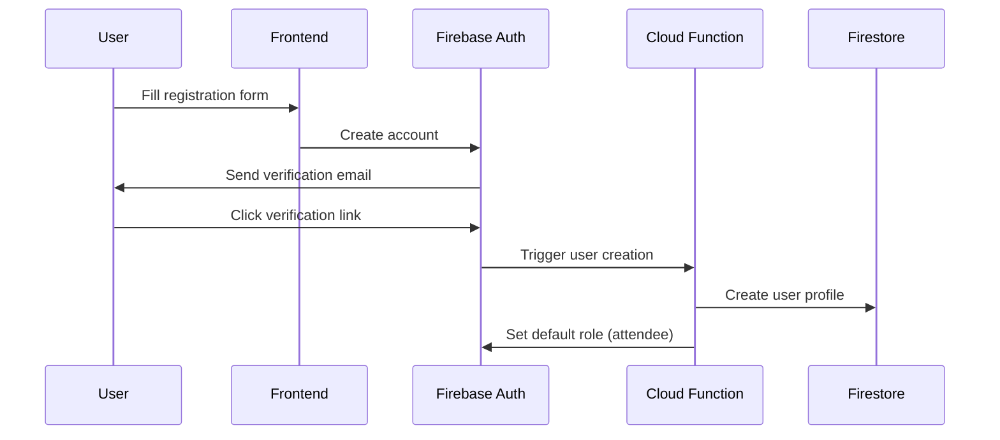
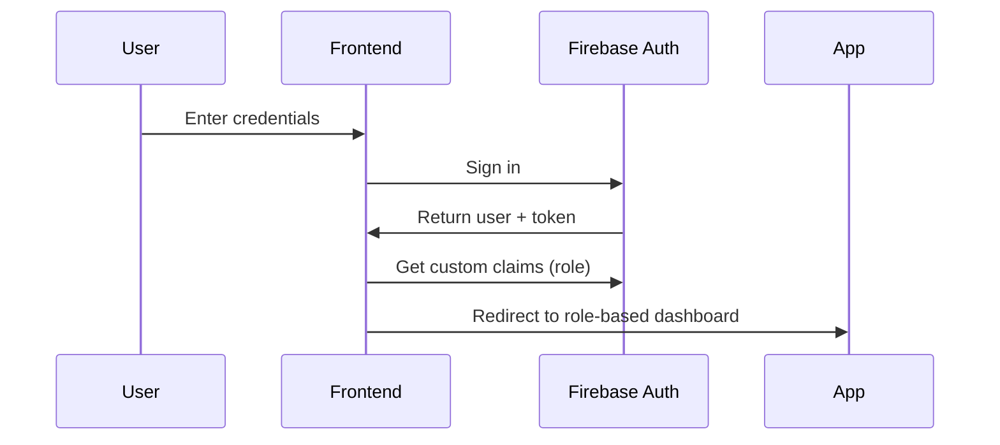
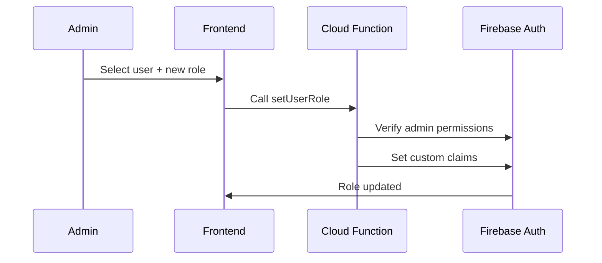

# **Authentication - StrokeTraining Platform v2.0**

**Firebase Authentication with Role-Based Access Control**

## **📁 Folder Structure**

```
auth/
├── config/                 # Environment configurations
│   ├── development/        # Development environment
│   │   ├── firebase.json
│   │   └── .firebaserc
│   ├── staging/            # Staging environment
│   │   ├── firebase.json
│   │   └── .firebaserc
│   └── production/         # Production environment
│       ├── firebase.json
│       └── .firebaserc
├── rules/                  # Security rules
│   ├── firestore.rules     # Firestore security rules
│   ├── storage.rules       # Storage security rules
│   └── functions.js        # Cloud Functions for role management
└── docs/                   # Documentation
    ├── AUTHENTICATION_SYSTEM_PLAN.md
    ├── SECURITY_GUIDELINES.md
    └── ROLE_MANAGEMENT.md
```

## **🎯 Responsibilities**

- **Identity Management**: User registration, login, password reset
- **Role-Based Access Control**: 4 user roles with specific permissions
- **Security Rules**: Firestore and Storage access control
- **Session Management**: Token handling and persistence
- **Audit & Compliance**: Activity logging and data protection

## **🛠️ Technology Stack**

- **Authentication**: Firebase Auth (Email/Password)
- **Authorization**: Custom Claims for roles
- **Security**: Firestore Security Rules
- **Functions**: Firebase Functions for admin tasks
- **Session**: Firebase Auth persistence (local)

## **👥 User Roles**

### **Role Hierarchy**
1. **attendee** - Healthcare professionals attending training
2. **specialist** - Stroke specialists and mentors
3. **admin** - AVC Espoir administrators
4. **stakeholder** - Donors and ministry officials

### **Permissions Matrix**
```
Feature                 attendee  specialist  admin  stakeholder
----------------------------------------------------------------
Authentication          ✓         ✓           ✓      ✓
Profile Management      ✓         ✓           ✓      ✓
View Documents          ✓         ✓           ✓      ✓
Upload Documents        ✗         ✓           ✓      ✗
Forum Participation     ✓         ✓           ✓      ✓
Forum Moderation        ✗         ✓           ✓      ✗
Submit Impact Data      ✓         ✓           ✓      ✗
View Own Analytics      ✓         ✓           ✓      ✗
View All Analytics      ✗         ✗           ✓      ✓
Generate Reports        ✗         ✗           ✓      ✗
User Management         ✗         ✗           ✓      ✗
```

## **🔐 Authentication Flows**

### **1. Registration Flow**


### **2. Login Flow**


### **3. Role Assignment Flow**


## **🚀 Getting Started**

### **Prerequisites**
- Firebase CLI installed (`npm install -g firebase-tools`)
- Firebase project created
- Email/Password authentication enabled in Firebase Console

### **Setup Instructions**

1. **Initialize Firebase Auth**
   ```bash
   # Login to Firebase
   firebase login
   
   # Select your project
   firebase use your-project-id
   ```

2. **Configure Authentication**
   ```bash
   # Enable Email/Password provider in Firebase Console
   # Authentication > Sign-in method > Email/Password > Enable
   ```

3. **Deploy Security Rules**
   ```bash
   # Deploy Firestore rules
   firebase deploy --only firestore:rules
   
   # Deploy Storage rules  
   firebase deploy --only storage
   ```

4. **Deploy Cloud Functions**
   ```bash
   # Deploy role management functions
   firebase deploy --only functions
   ```

## **📋 Security Rules**

### **Firestore Security Rules**
```javascript
rules_version = '2';
service cloud.firestore {
  match /databases/{database}/documents {
    // Helper functions
    function isAuthenticated() {
      return request.auth != null;
    }
    
    function isAdmin() {
      return isAuthenticated() && request.auth.token.role == 'admin';
    }
    
    function isSpecialist() {
      return isAuthenticated() && request.auth.token.role == 'specialist';
    }
    
    function isOwner(userId) {
      return isAuthenticated() && request.auth.uid == userId;
    }
    
    // Users can manage their own profile
    match /users/{userId} {
      allow read, update: if isOwner(userId);
      allow read: if isAdmin();
      allow create: if isAuthenticated();
    }
    
    // Document access based on roles
    match /documents/{documentId} {
      allow read: if isAuthenticated();
      allow create, update: if isAdmin() || isSpecialist();
      allow delete: if isAdmin();
    }
    
    // Impact metrics - users own data + admin access
    match /impactMetrics/{metricId} {
      allow create, read, update: if isAuthenticated() && 
        resource.data.userId == request.auth.uid;
      allow read: if isAdmin() || 
        request.auth.token.role == 'stakeholder';
    }
  }
}
```

### **Storage Security Rules**
```javascript
rules_version = '2';
service firebase.storage {
  match /b/{bucket}/o {
    // Documents folder - role-based upload
    match /documents/{allPaths=**} {
      allow read: if request.auth != null;
      allow write: if request.auth != null && 
        (request.auth.token.role == 'admin' || 
         request.auth.token.role == 'specialist');
    }
    
    // Profile photos - users can upload their own
    match /profiles/{userId}/{allPaths=**} {
      allow read: if request.auth != null;
      allow write: if request.auth != null && 
        request.auth.uid == userId;
    }
  }
}
```

## **⚙️ Cloud Functions**

### **Role Management Function**
```typescript
// functions/src/auth/setUserRole.ts
import { onCall, HttpsError } from 'firebase-functions/v2/https';
import { getAuth } from 'firebase-admin/auth';

export const setUserRole = onCall(async (request) => {
  const { uid, role } = request.data;
  
  // Verify caller is admin
  if (!request.auth || request.auth.token.role !== 'admin') {
    throw new HttpsError('permission-denied', 'Admin access required');
  }
  
  // Validate role
  const validRoles = ['attendee', 'specialist', 'admin', 'stakeholder'];
  if (!validRoles.includes(role)) {
    throw new HttpsError('invalid-argument', 'Invalid role');
  }
  
  try {
    // Set custom claims
    await getAuth().setCustomUserClaims(uid, { role });
    
    // Log the role change
    console.log(`Role changed: ${uid} -> ${role} by ${request.auth.uid}`);
    
    return { success: true, message: `Role set to ${role}` };
  } catch (error) {
    throw new HttpsError('internal', 'Failed to set role');
  }
});
```

### **User Profile Creation**
```typescript
// functions/src/auth/createUserProfile.ts
import { onDocumentCreated } from 'firebase-functions/v2/firestore';
import { getAuth } from 'firebase-admin/auth';

export const createUserProfile = onDocumentCreated(
  'users/{userId}',
  async (event) => {
    const userData = event.data?.data();
    const userId = event.params.userId;
    
    if (!userData) return;
    
    try {
      // Set default role if not already set
      const user = await getAuth().getUser(userId);
      if (!user.customClaims?.role) {
        await getAuth().setCustomUserClaims(userId, { role: 'attendee' });
      }
      
      console.log(`User profile created: ${userId}`);
    } catch (error) {
      console.error('Error creating user profile:', error);
    }
  }
);
```

## **🔗 Frontend Integration**

### **Auth Context**
```typescript
// frontend/src/contexts/AuthContext.tsx
import { createContext, useContext, useEffect, useState } from 'react';
import { 
  User, 
  onAuthStateChanged, 
  signInWithEmailAndPassword,
  createUserWithEmailAndPassword,
  signOut 
} from 'firebase/auth';
import { auth } from '../services/firebase';

interface AuthContextType {
  user: User | null;
  role: string | null;
  loading: boolean;
  login: (email: string, password: string) => Promise<void>;
  register: (email: string, password: string, profileData: any) => Promise<void>;
  logout: () => Promise<void>;
}

const AuthContext = createContext<AuthContextType | null>(null);

export const useAuth = () => {
  const context = useContext(AuthContext);
  if (!context) throw new Error('useAuth must be used within AuthProvider');
  return context;
};

export const AuthProvider: React.FC<{ children: React.ReactNode }> = ({ children }) => {
  const [user, setUser] = useState<User | null>(null);
  const [role, setRole] = useState<string | null>(null);
  const [loading, setLoading] = useState(true);

  useEffect(() => {
    const unsubscribe = onAuthStateChanged(auth, async (user) => {
      setUser(user);
      
      if (user) {
        const tokenResult = await user.getIdTokenResult();
        setRole(tokenResult.claims.role as string || 'attendee');
      } else {
        setRole(null);
      }
      
      setLoading(false);
    });

    return unsubscribe;
  }, []);

  const login = async (email: string, password: string) => {
    await signInWithEmailAndPassword(auth, email, password);
  };

  const register = async (email: string, password: string, profileData: any) => {
    const credential = await createUserWithEmailAndPassword(auth, email, password);
    
    // Create user profile in Firestore
    const userDoc = {
      email,
      profile: profileData,
      role: 'attendee',
      createdAt: new Date(),
    };
    
    // This will trigger the Cloud Function to set custom claims
    await setDoc(doc(db, 'users', credential.user.uid), userDoc);
  };

  const logout = async () => {
    await signOut(auth);
  };

  return (
    <AuthContext.Provider value={{ user, role, loading, login, register, logout }}>
      {children}
    </AuthContext.Provider>
  );
};
```

## **🔒 Security Best Practices**

### **Password Security**
- Minimum 8 characters
- Mix of uppercase, lowercase, numbers
- Firebase handles secure storage
- Account lockout after failed attempts

### **Session Security**
- Token auto-refresh handled by Firebase
- Secure token storage in browser
- Session persistence options
- Logout clears all cached data

### **Audit & Compliance**
- Log role changes and admin actions
- Track login attempts and failures
- Monitor suspicious activity
- GDPR-compliant data handling

## **📊 Monitoring & Analytics**

### **Authentication Metrics**
- User registration rates
- Login success/failure rates
- Role distribution
- Session duration
- Security incidents

### **Firebase Console Monitoring**
```bash
# View authentication logs
firebase functions:log --only setUserRole

# Monitor authentication metrics
# Check Firebase Console > Authentication > Users
```

## **🔗 Related Documentation**

- [Authentication System Plan](docs/AUTHENTICATION_SYSTEM_PLAN.md)
- [Security Guidelines](docs/SECURITY_GUIDELINES.md)
- [Role Management Guide](docs/ROLE_MANAGEMENT.md)
- [Troubleshooting Auth Issues](docs/TROUBLESHOOTING.md)

## **📞 Quick Commands**

```bash
# Deploy authentication components
firebase deploy --only firestore:rules,storage,functions

# Test security rules
firebase emulators:start --only firestore,auth
npm run test:rules

# View auth logs
firebase functions:log --only auth

# Manage users (requires admin privileges)
firebase auth:export users.json
firebase auth:import users.json
```

## **🎯 Development Phases**

### **Phase 1: Basic Auth (Week 1-2)**
- Email/password authentication
- User registration and login
- Basic security rules
- Profile creation

### **Phase 2: Role System (Week 3-4)**  
- Custom claims implementation
- Role-based access control
- Admin user management
- Security rule refinement

### **Phase 3: Advanced Security (Week 5-6)**
- Audit logging
- Account management features
- Security monitoring
- Compliance features

Ready to build a secure authentication system! 🔐